# Pentester-Lab-From-SQL-injection-to-Shell-walkthrough

**Description**

Difficulty: Beginner

Details:

This exercise explains how you can from a SQL injection gain access to the administration console.
Then in the administration console, how you can run commands on the system.

What you will learn?

SQL injection exploitation using UNION
Cracking md5 hashed passwords
Writing a PHP webshell

    Name: Pentester Lab: From SQL injection to Shell
    Date release: 13 Sep 2012
    Author: Pentester Lab
    Series: Pentester Lab
    Web page: http://www.pentesterlab.com/exercises/from_sqli_to_shell/

[Vulnhub link](https://www.vulnhub.com/entry/pentester-lab-from-sql-injection-to-shell,80/)

Let's start hacking!

**Step 1: Scan the machine**

> nmap -A <IP_address_of_your_machine> 

From the scan we can see that, port 22 and 80 are open. Let's explore port 80.

**Step 2: Go to machine's IP in web browser**

In your web browser

> http://<IP_address_of_your_machine>

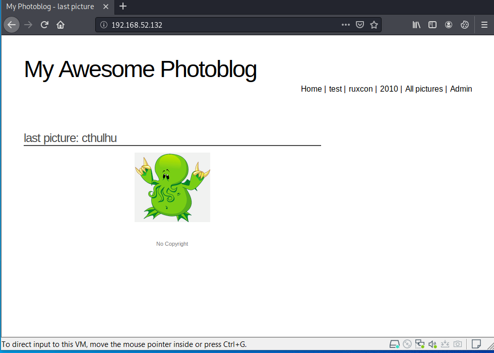

Click on the test which is at the right side

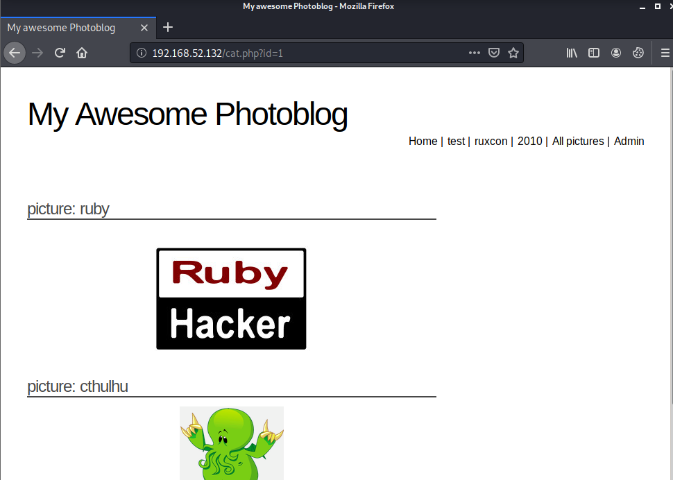

It looks like the URL maybe useful for us.

**Step 3: Check for SQL Injection**

Put `'` at the end of the URL and press enter

> http://<IP_address_of_your_machine>/cat.php?id=1'

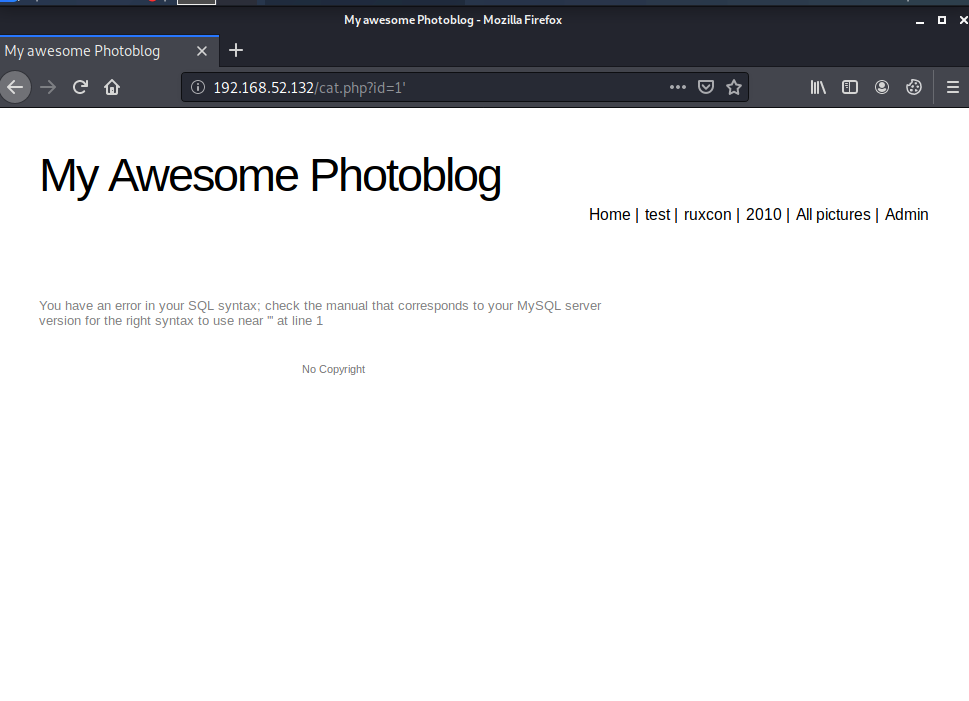

Yep. The website is vulnerable to SQL injection.

**Step 4: Try SQL injection**

> sqlmap -u http://<IP_address_of_your_machine>/cat.php?id=1 --dbs

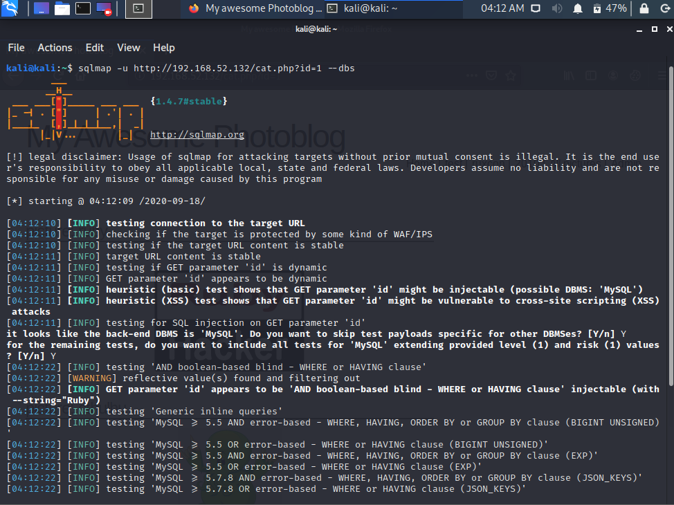

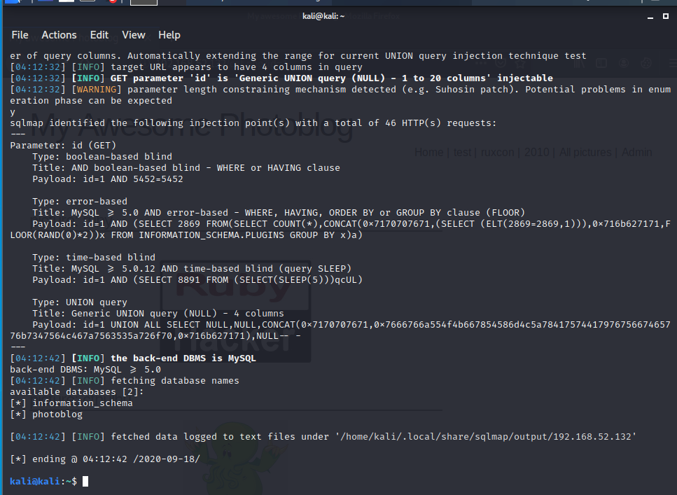

Looks like we got the database!!

**Step 5: Dump all the data**

Retrieve all the data from the database `photoblog`

> sqlmap -u http://<IP_address_of_your_machine>/cat.php?id=1 -D photoblog --dump-all --batch

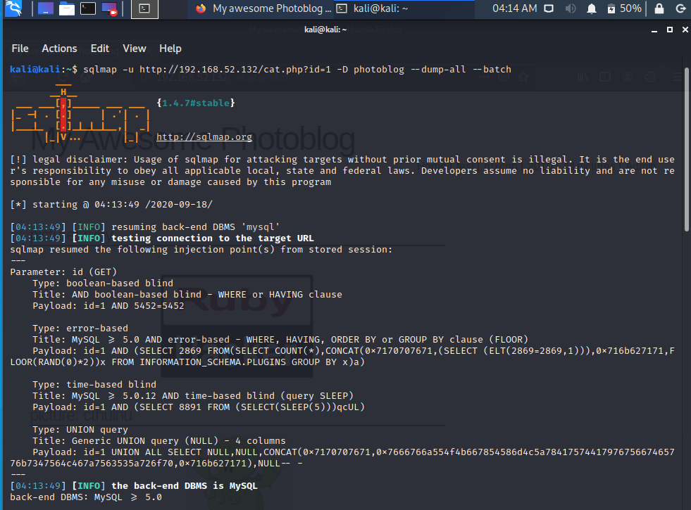

Looks like we got the username and password! Let's try it out.

**Step 6: Login to admin**

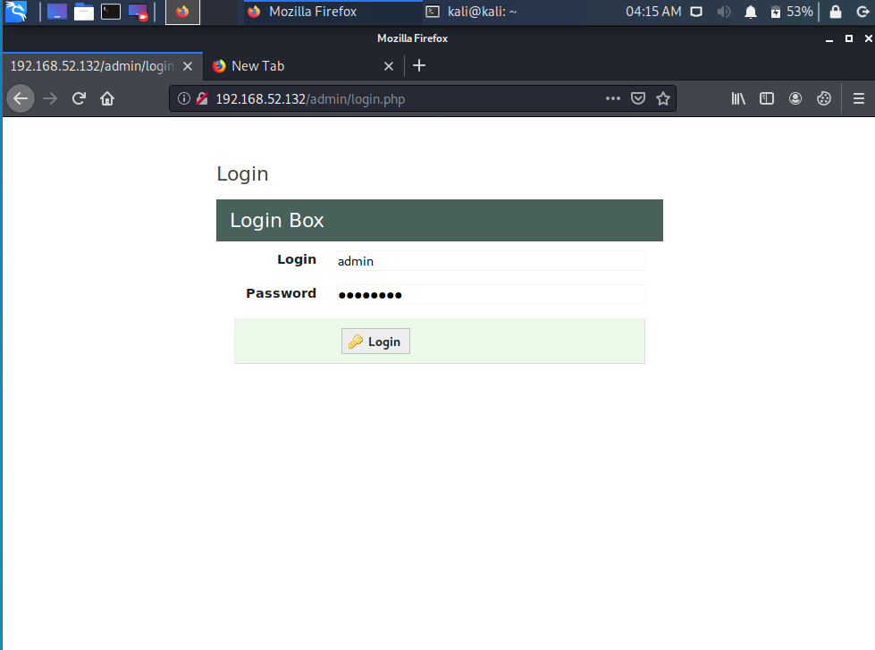

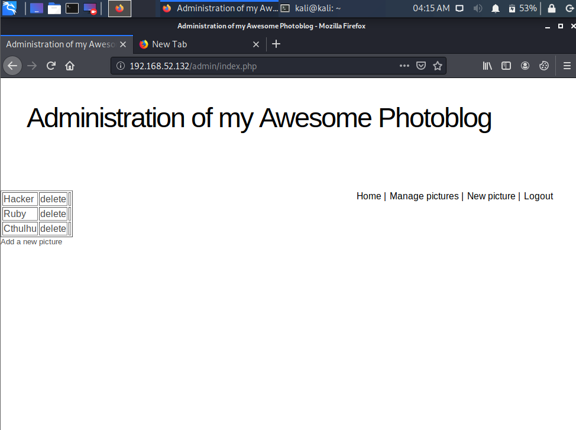

Looks like this dashboard is for uploading pictures. We'll upload a php reverse shell here and see if we can get the shell!

**Step 7: Upload the php reverse shell**

I got the php reverse shell from [here](https://github.com/pentestmonkey/php-reverse-shell) After getting the file you have to change the IP  to your IP so that you can get the reverse shell to your pc.

Uploading the php file

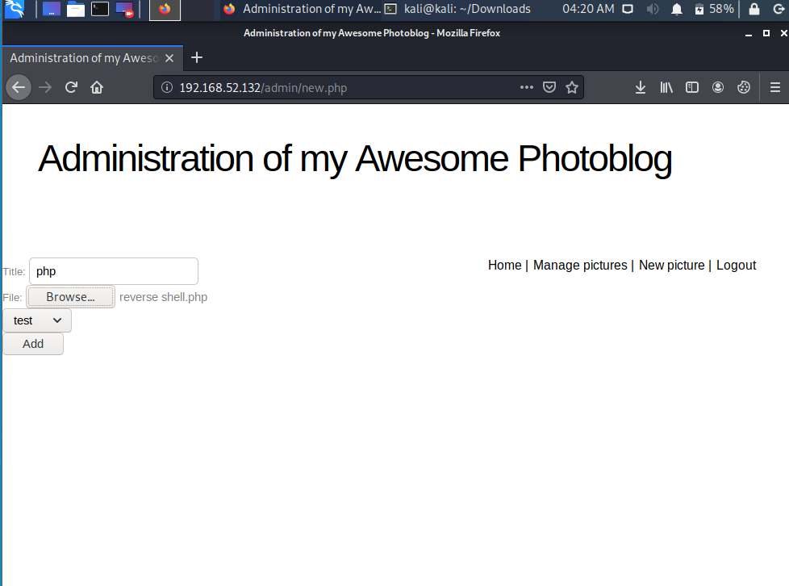

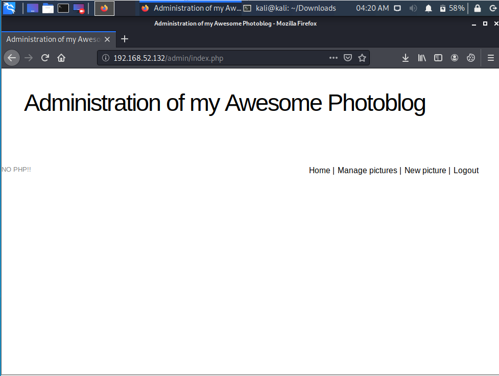

Looks like we can't upload `php` extension file. Let's modify the extension to `pHP` and try to upload it again

**Step 8: Changing the extension and re-uploading the php reverse shell**

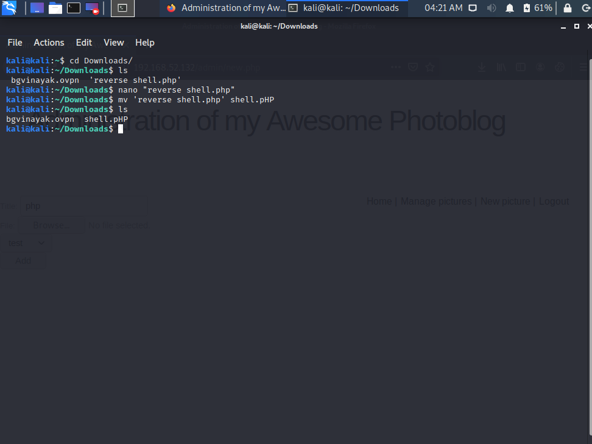

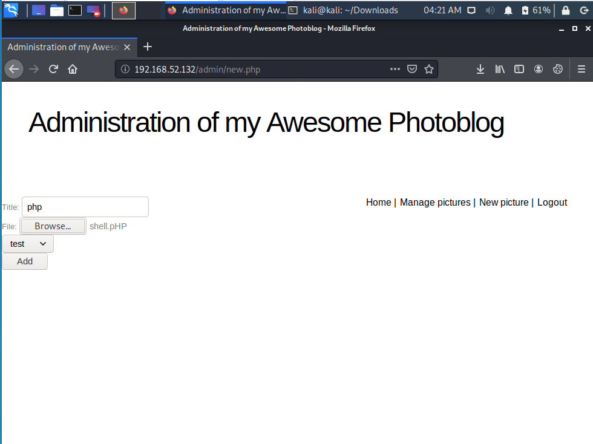

So we are able to upload the php reverse shell.

**Step 9: Connect to reverse shell**

> nc -lvp 1234

After executing the command on the terminal, open the uploaded php file on the website or click on the file you have uploaded.

You'll get the connection like this

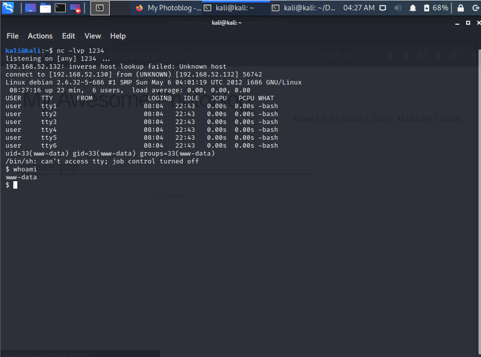

Thank you!
